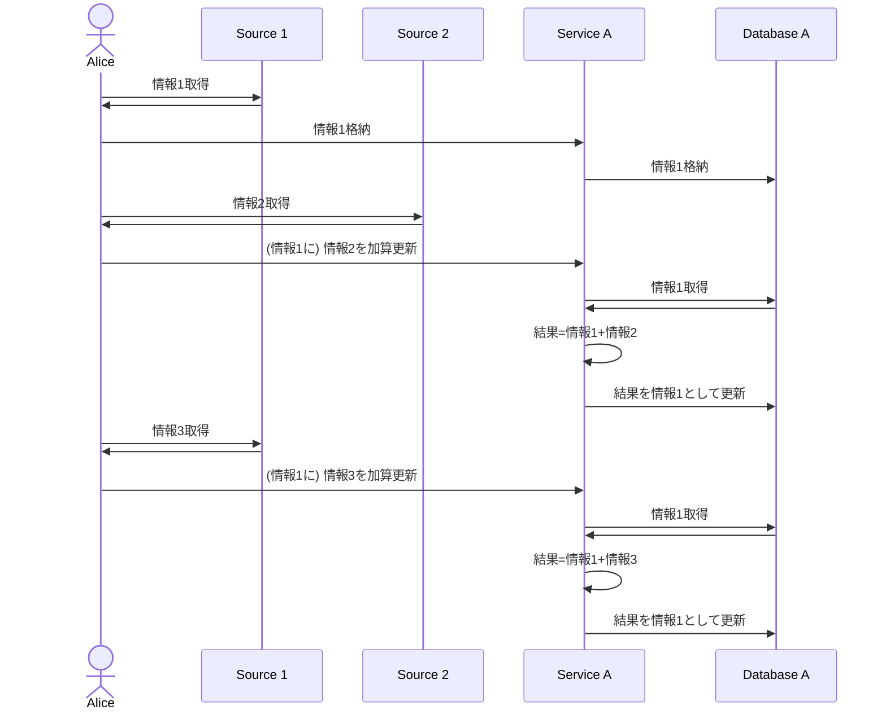

```mermaid
sequenceDiagram
    actor Alice
    participant Source 1
    participant Source 2
    participant Service A
    participant Database A

    Alice->>Source 1: 情報1取得
    Source 1->>Alice: 
    Alice->>Service A: 情報1格納
    Service A->>Database A: 情報1格納
    Alice->>Source 2: 情報2取得
    Source 2->>Alice: 
    Alice->>Service A: (情報1に) 情報2を加算更新
    Service A->>Database A: 情報1取得
    Database A->>Service A: 
    Service A->>Service A: 結果=情報1+情報2
    Service A->>Database A: 結果を情報1として更新
    Alice->>Source 1: 情報3取得
    Source 1->>Alice: 
    Alice->>Service A: (情報1に) 情報3を加算更新
    Service A->>Database A: 情報1取得
    Database A->>Service A: 
    Service A->>Service A: 結果=情報1+情報3
    Service A->>Database A: 結果を情報1として更新
```
